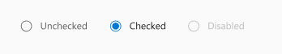
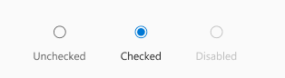
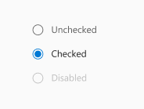
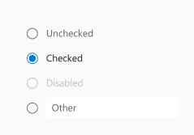
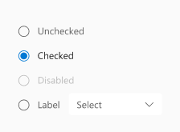

# @iqvizyonui/react-radio Spec

A Radio allows a user to select a single value from two or more options. All Radios with the same `name` are considered to be part of the same group. However, a `RadioGroup` is recommended to add a group label, formatting, and other functionality.

## Background

### Prior Art

- [OpenUI research](https://open-ui.org/components/radio-button.research)
- [Epic](https://github.com/iBz-04/iqvui/issues/19953)

## Variants

### Layout

#### Horizonal

Inline positioning of the inputs and labels.



#### Horizonal stacked

Positioning the label at the bottom of the radio inputs.



#### Vertical

Default vertical positioning of Radio items.



#### Vertical with input

Default positioning of Radio items with an input as its last Radio item.



### Vertical with dropdown

Default positioning of Radio items with a dropdown as its last Radio item.



## API

### Components

| Component         | Purpose                                                                         |
| ----------------- | ------------------------------------------------------------------------------- |
| RadioGroup        | Wraps radio inputs. Provides RadioGroupContext and layout for the radio items.  |
| RadioGroupContext | Provides some props like `name` to Radio items that are children of RadioGroup. |
| Radio             | Represents a single radio item (input and label).                               |

### RadioGroup

Link to [RadioGroup.types.ts](https://github.com/iBz-04/iqvui/blob/master/packages/react-radio/src/components/RadioGroup/RadioGroup.types.ts)

| Prop           | Type                                                | Default value          | Purpose                                                  |
| -------------- | --------------------------------------------------- | ---------------------- | -------------------------------------------------------- |
| (root)         | slot: `<div role="radiogroup">`                     |                        | The root slot has the radiogroup role.                   |
| `name`         | `string`                                            | `useId('radiogroup-')` | Name property passed to child radios.                    |
| `value`        | `string`                                            |                        | Currently selected value. Used only for controlled mode. |
| `defaultValue` | `string`                                            |                        | Default selected value.                                  |
| `disabled`     | `boolean`                                           | `false`                | Disables all radio items inside the group.               |
| `layout`       | `"vertical" \| "horizontal" \| "horizontalStacked"` | `vertical`             | Specifies the layout of the radio items.                 |
| `onChange`     | `(event, data: { value: string }) => void`          |                        | Callback when a radio item is selected.                  |

### RadioGroupContext

This is a context object provided by RadioGroup that allows all of the child Radio items to have the same name, and coordinate the selected item.

The context contains the following props from RadioGroup:

- `name`
- `layout`
- `defaultValue`
- `value`
- `disabled`

### Radio

Link to [Radio.types.ts](https://github.com/iBz-04/iqvui/blob/master/packages/react-radio/src/components/Radio/Radio.types.ts)

| Prop        | Type                         | Purpose                                                             |
| ----------- | ---------------------------- | ------------------------------------------------------------------- |
| (root)      | slot: `<span>`               | Wrapper for the input, indicator, and label                         |
| `input`     | slot: `<input type="radio">` | Hidden input element that handles the radio's behavior.             |
| `indicator` | slot: `<div>`                | The circular indicator to show the radio's checked/unchecked state. |
| `label`     | slot: `<Label>`              | Label that will be rendered next to the radio indicator.            |
| `value`     | `string`                     | The value of the RadioGroup when this Radio is selected             |
| `checked`   | `boolean`                    | Whether the input is checked or not.                                |
| `disabled`  | `boolean`                    | Whether the input is disabled or not.                               |

## Sample Code

A simple `RadioGroup`.

```jsx
<RadioGroup defaultValue="one">
  <Radio value="one" label="Option One" />
  <Radio value="two" label="Option Two" />
  <Radio value="three" label="Option Three" />
</RadioGroup>
```

`Radio` can be used without a `RadioGroup`, but it is then up to the user to add the same `name` to each item:

```jsx
<>
  <Radio name="number" value="one" label="Option One" defaultChecked />
  <Radio name="number" value="two" label="Option Two" />
  <Radio name="number" value="three" label="Option Three" />
</>
```

## Structure

### Expected DOM structure

```html
<div role="radiogroup" class="iui-RadioGroup" name="radiogroup-0">
  <span class="iui-Radio">
    <input type="radio" id="radio-1" name="radiogroup-0" value="one" checked />
    <div class="iui-Radio__indicator">
      <svg><circle /></svg>
    </div>
    <label class="iui-Label" for="radio-1">Option One</label>
  </span>

  <span class="iui-Radio">
    <input type="radio" id="radio-2" name="radiogroup-0" value="two" />
    <div class="iui-Radio__indicator">
      <svg><circle /></svg>
    </div>
    <label class="iui-Label" for="radio-2">Option Two</label>
  </span>

  <span class="iui-Radio">
    <input type="radio" id="radio-3" name="radiogroup-0" value="three" />
    <div class="iui-Radio__indicator">
      <svg><circle /></svg>
    </div>
    <label class="iui-Label" for="radio-3">Option Three</label>
  </span>
</div>
```

## Behaviors

### Mouse/Touch

The Radio's hit target fills the entire space around the indicator and label (including the padding).

### Keyboard

RadioGroup inherits all of its mouse and keyboard behaviors from the browser's handling of `<input type="radio">`.

- It has no special handling of clicks or keypresses for toggling beyond the built-in control.
- The browser handles arrow key selection, and creating a single tab stop for the control.

### Disabled

- Individual Radio items can be disabled, in which case they are grayed out and can't be selected or focused.
  - This interaction is built-into the browser by setting `disabled` on the `<input>` control.
- The entire RadioGroup can be disabled, which uses RadioGroupContext to disable all of the individual Radio items.

### Group Name

- All Radio items in a group must have the same `name` for the browser to handle keyboarding and selection.
- The RadioGroup provides its `name` through RadioGroupContext, and each Radio inside applies the `name`.
- If a `name` is not provided on RadioGroup, a unique name is automatically generated with `useId`.

## Accessibility

### RadioGroup

This implementation based on the [Grouping Controls](https://www.w3.org/WAI/tutorials/forms/grouping/) examples of Web Accessibility Tutorials (that follow WCAG).

- The RadioGroup root is a `<div role="radiogroup">` to provide the default accessibility behavior of a radiogroup.
- If a group label is added, the RadioGroup needs to have `aria-labelledby` referencing the label.

### Radio

- The Radio's primary slot is an `<input type="radio">`, with opacity 0, and covers the root.
  - This way, the Radio's hit target fills the entire space around the indicator and label (including the padding).
- The Radio's label is a `<label>` element with `for={input.id}` to associate it with the input slot.
