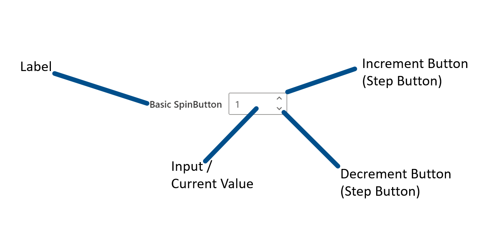
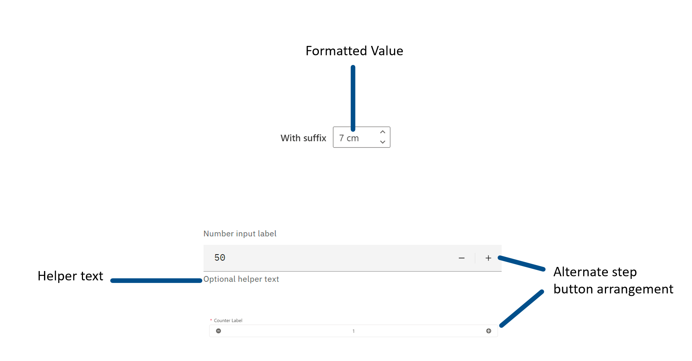
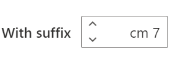

# @iqvizyonui/react-spinbutton Spec

## Background

SpinButtons are used to allow numeric input bounded between minimum and maximum values with button controls to increment and decrement the input value by some step amount. Values can also be manipulated via the keyboard.

## Prior Art

- Open UI research: https://github.com/openui/open-ui/pull/431
- Github Epic: https://github.com/iBz-04/iqvui/issues/20930
- WAI-ARIA Toolbar Example (font size selector): https://www.w3.org/TR/wai-aria-practices/examples/toolbar/toolbar.html

### Naming

There is little consensus for naming this type of component. Of the design systems surveyed in Open UI there are seven implementations with six different names:

1. InputNumber
2. NumberInput
3. SpinButton (x2)
4. NumberField
5. Counter
6. input-stepper

This specification recommends `SpinButton` as the name for this component. Given the lack of naming consensus in the surveryed design systems and that the ARIA role for this control is `spinbutton` this feels like the closest to a standard name.

### Anatomy

`SpinButton` consists of three mandatory parts:

1. **Input**: accepts users input and displays the current value.
2. **Increment Button**: a button that increases the current value by the step amount.
3. **Decrement Button**: a button that decreases the current value by the step amount.

`SpinButton` has several optional parts:

1. **Label**: any input must have a label but whether the label is included as part of the `SpinButton` control varies depending on the design system.
2. **Helper text**: extra text in addition to the label to provide "help", perhaps by offering an example. Typically appears below the input.
3. **Formatted value**: optional formatting applied to the input value. For example, turning "12" into "12 pt" for a font size picker.

Note that labels and helper text are included here for completeness but will be omitted from the converged `SpinButton` as there is an [open RFC discussing how to handle these elements for vNext](https://github.com/iBz-04/iqvui/issues/19627#issuecomment-1022646775).

#### Base `SpinButton` Anatomy



#### Alternate/Optional `SpinButton` Anatomy



### Common Features

#### Attributes

1. **min**: the minimum valid value for the control
2. **max**: the maximum valid value for the control
3. **step**: the step size or amount the value is changed by one increment or decrement
4. **value**: the current value for the control

#### Direct Input

All `SpinButtons` surveyed can take input directly by typing into the control's input field. Many clamp this value in the range of `min`-`max` but, notably, the native HTML control does not. Rather, it allows values outside this range but puts the control into an invalid state. The [ARIA spec](https://www.w3.org/TR/wai-aria-practices/#wai-aria-roles-states-and-properties-18) allows for the native control behavior or for values to be restricted to only valid values as determined by users of the control.

#### Step Buttons

All `SpinButtons` have support for incrementing and decrementing the value via step buttons. Clicking a step button changes the current value of the control by a `step` size (e.g., `1`, `0.1`, `10`, etc.).

When using a keyboard step buttons are not focusable, rather the control uses the up and down keyboard arrows to modify the current value with the same rules as clicking a step button.

Unlike directly typing input into the control, step buttons do not allow input outside of the bounds of `min` and `max`.

### i18n

#### RTL (Right to Left Languages)

Most implementations flip the layout of the control for RTL. Using the base example, the step buttons appear on the left with the value on the right as opposed to the LTR version where the value is on the left and the steppers on the right.



### a11y

The [WAI-ARIA spec for SpinButton](https://www.w3.org/TR/wai-aria-practices/#spinbutton) covers this well and provides examples.

### [input type="number"](https://developer.mozilla.org/en-US/docs/Web/HTML/Element/input/number)

This is a standard HTML control for entering numbers. It includes built-in validation to reject non-numeric values and optionally provides stepper arrows to increment or decrement the value.

#### Element Attributes

This is not an exhaustive list of attributes for this element but a curated list of relevant attributes. For a complete list [see the MDN page for `<input type="number">`](https://developer.mozilla.org/en-US/docs/Web/HTML/Element/input/number#additional_attributes)

| Attribute | Description                                                                     |
| --------- | ------------------------------------------------------------------------------- |
| list      | Allows the input to be associated with a `datalist` to provide suggested values |
| max       | Maximum acceptable value. Must be greater than or equal to `min`                |
| min       | Minimum acceptable value. Must be less than or equal to `max`                   |
| step      | The granularity of the value when incrementing or decrementing                  |

Despite supporting both `min` and `max` attributes a native number input will allow users to enter values outside the specified bounds. This situation is resolved via a process called [constraint validation](https://developer.mozilla.org/en-US/docs/Web/Guide/HTML/Constraint_validation) that adds CSS pseudo classes to the element for styling purposes and raises validation events.

There are very few options for cross-browser styling of native number inputs. The [::-webkit-inner-spin-button](https://developer.mozilla.org/en-US/docs/Web/CSS/::-webkit-inner-spin-button) pseudo element allows for selecting the spin buttons of a number input but is only supported by Webkit and Blink based browsers.

Native number inputs are meant strictly for number input but what constitutes number input is inconsistent across browsers ([see this Bugzilla issue for details](https://bugzilla.mozilla.org/show_bug.cgi?id=1398528)). You can easily see this on [MDN's simple example](https://developer.mozilla.org/en-US/docs/Web/HTML/Element/input/number#a_simple_number_input). In Edge 96 you can enter exponential numbers like "1e+343434" but not arbitrary strings like "cats". On the same example in Firefox 95 you can enter both "1e+343434" and "cats".

Inspecting a native number input with devtools shows that it implements the [spinbutton ARIA attributes as described by WAI-ARIA](https://www.w3.org/TR/wai-aria-practices/#spinbutton)

#### Examples

- [Controlling Step Size](https://developer.mozilla.org/en-US/docs/Web/HTML/Element/input/number#controlling_step_size)
- [Specifying Minimum and Maximum Values](https://developer.mozilla.org/en-US/docs/Web/HTML/Element/input/number#specifying_minimum_and_maximum_values)
- [Allowing Decimal Values](https://developer.mozilla.org/en-US/docs/Web/HTML/Element/input/number#allowing_decimal_values)
- [Offering Suggested Values](https://developer.mozilla.org/en-US/docs/Web/HTML/Element/input/number#offering_suggested_values)

## Sample Code

### Uncontrolled Example

```tsx
<SpinButton defaultValue="1" />
```

### Controlled Example

```tsx
type SpinButtonChangeData = {
  value?: number;
  displayValue?: string;
};

const [value, setValue] = useState<number>(2);
const onControlledExampleChange = (_event, data: SpinButtonChangeData) => {
  setValue(data.value);
};

<SpinButton value={value} onChange={onControlledExampleChange} />;
```

### Custom Display Format Example

```tsx
type SpinButtonChangeData = {
  value: number;
};

type FormatterFn = (value: number) => string;
type ParserFn = (formattedValue: string) => number;

// Takes a number in and returns a formatted string
// Ex: 12 becomes "12 pt"
const fontFormatter: FormatterFn = value => {
  return `${value} pt`;
};

// Takes a formatted string in and returns a number
// Ex: "12 pt" becomes 12
const fontParser: ParserFn = formattedValue => {
  return parseFloat(formattedValue);
};

const [value, setValue] = useState<number>(3);
const [displayValue, setDisplayValue] = useState<string>(formatter(3));)

const onControlledExampleChange = (_event, data: SpinButtonChangeData) => {
  if (data.value !== undefined) {
    setValue(data.value);
    setDisplayValue(fontFormatter(data.value));
  } else if (data.displayValue !== undefined) {
    const nextValue = fontParser(data.displayValue);
    setValue(nextValue);
    setDisplayValue(fontFormatter(nextValue));
  }
};

<SpinButton
  value={value}
  displayValue={displayValue}
  onChange={onControlledExampleChange}
/>
```

### Basic Example Implementation

A very basic example to demonstrate how formatting will work in practice.

[Link to example on Codesandbox](https://codesandbox.io/s/spinbutton-example-formatted-values-66pou?file=/src/SpinButton/SpinButton.js)

## API

[See the types](./components/SpinButton/SpinButton.types.ts)

## Structure

- _**Public**_

```tsx
<SpinButton value={10} displayValue="$10.00" min={1} max={100} step={5} />
```

- _**Internal**_

```tsx
<slots.root {...slotProps.root}>
  <slots.input {...slotProps.input} />
  <slots.incrementButton {...slots.incrementButton} />
  <slots.decrementButton {...slots.decrementButton} />
</slots.root>
```

- _**DOM** - how the component will be rendered as HTML elements_

Note that `aria-valuetext` is conditionally rendered. In this case it is rendered because formatting is applied in this example by the `displayValue` prop in JSX.

```html
<!-- root slot -->
<div class="iui-SpinButton">
  <!-- input slot -->
  <input
    type="text"
    role="spinbutton"
    class="iui-SpinButton-input"
    value="$10.00"
    aria-valuenow="10"
    aria-valuemin="1"
    aria-valuemax="100"
    aria-valuetext="$10.00"
  />
  <!-- increment button slot -->
  <!-- note we'll probably using icons rather than "+" and "-" inside the buttons -->
  <button tabindex="-1" type="button" class="iui-SpinButton-button iui-SpinButton-increment-button">+</button>
  <!-- decrement button slot -->
  <button tabindex="-1" type="button" class="iui-SpinButton-button iui-SpinButton-decrement-button">-</button>
</div>
```

## Behaviors

`SpinButton`'s `value` prop is always a number. `SpinButton`s manipulate numeric values and making `value` a number aligns it with the other related props: `min`, `max` and `step`. `SpinButton`'s `value` is always displayed as a string which is determined by the `displayValue` prop or by stringifying `value` when `displayValue` is not provided (for uncontrolled `SpinButton`s `defaultValue` is stringified rather than `value`).

`SpinButton` users may apply custom formatting to the component by providing a value to the `displayValue` prop.

Values outside of the min/max bounds can be provided to `SpinButton` and they will be displayed. When stepping the value with the step buttons or hotkeys the value will not be stepped outside of the min/max bounds. If the value starts outside of the min/max bounds and is stepped it will update to a value outside of the bounds. Once the value is stepped inside the min/max bounds it will be clamped to this range.

For example, assume a `SpinButton` with min=5, max=10, value=1 and step=1. Incrementing `value` with the stepper will increase it to 2.

Any value may be typing into the `<input>` element of `SpinButton`. When typing into the input `SpinButton` enters an intermediate state where changes to the input are not applied to `value`. Instead the user must "commit" their edits to trigger a `value` update. This can be done two ways:

1. Blur the input field (i.e., tab or click away)
2. Use one of `SpinButton`'s hotkeys to modify the value.

Aside from min/max range clamping behavior described above `SpinButton` does not currently implement any input validation.

No error states are currently implemented.

`SpinButton`'s `onChange` callback is invoked every time a change is committed. A change is committed when:

1. A step button is activated (e.g., clicked with a mouse or activated with a screen reader)
2. When a user presses the `Arrow Up`, `Arrow Down`, `Home` or `End` keys while focused on the component.
3. When the `blur` event is fired from the `<input>`

The `onChange` callback is not invoked while a user is focused on the `<input>` and editing the value of the `SpinButton` directly.

### Component States

- Rest (no value or valid value, not focused)
- Focused
- Disabled
- Error/Warning (value is invalid in some way). NB: error and validation are not currently supported.

### Interaction

#### Keyboard

- Tab focuses the `<input>` element
- Up arrow key increments the value by `step` until `max`, if specified.
- Down arrow key decrements the value by `step` until `min`, if specified.
- Home key sets the value to `min`, if specified.
- End key sets the value to `max`, if specified.
- Tab never focuses the increment or decrement buttons as their functionality is fully available via the keyboard

#### Cursor

- Clicking on the `<input>` focuses it.
  - Input supports all device/platform mouse interactions (i.e., text selection)
- Clicking the increment button increases the value by `step` until `max`, if specified.
- Clicking the decrement button decreases the value by `step` until `min`, if specified.

#### Touch

Same as cursor.

#### Screen Readers

- `<input>` is focusable and editable using standard device/platform interactions.
- increment and decrement buttons are both focusable and usable with standard device/platform interactions.
- If formatting is applied to values `aria-valuetext` is applied to the `spinbutton` and read by the screen reader.

## Accessibility

The converged `SpinButton` component will not use the native HTML spin button (`input type="number"`) as this control has inconsistent cross-browser behavior and lacks styling options. Rather ARIA will be applied to achieve an accessible component that behaves consistently on all support platforms with robust styling options.

Only the `<input>` element of `SpinButton` can be focused via the keyboard. The ARIA `spinbutton` design pattern calls for keyboard shortcuts (up/down arrow) to fulfill the value step functionality, making focus for the increment and decrement buttons redundant.

- [ARIA design pattern: SpinButton](https://www.w3.org/TR/wai-aria-practices/#spinbutton)
  - [Date Picker Example](https://www.w3.org/TR/wai-aria-practices/examples/spinbutton/datepicker-spinbuttons.html)
  - [Toolbar (Font Picker) Example](https://www.w3.org/TR/wai-aria-practices/examples/toolbar/toolbar.html)
