# @iqvizyonui/react-table Spec

## Background

A table is a control that represents information in a two dimensional format in rows and columns.
A table can also be interactive where the user can navigation each individual cell in the table using
keyboard or nest controls inside table cells. Tables should can include both header and footer cells
that can be used to label the data in the associated cells or facilitate data sorting.

## Prior Art

- https://open-ui.org/components/table.research
- [23983](https://github.com/iqvizyon-development/iqv-design-system/issues/23983)

## Sample Code

```tsx
<Table>
  <TableHeader>
    <TableRow>
      <TableCell> </TableCell>
      <TableCell> </TableCell>
      <TableCell> </TableCell>
    </TableRow>
  </TableHeader>

  <TableBody>
    <TableRow>
      <TableCell> </TableCell>
      <TableCell> </TableCell>
      <TableCell> </TableCell>
    </TableRow>
  </TableBody>
</Table>
```

## Variants

### Sorting

The table header should support design and interactions for sorting the table by column.

### Selectable rows

Table rows can be selected. The table header should also support a 'select all' feature, selecting the
table header should select all rows.

### Primary column

A primary column is generally the first column of the table, however there is no strict requirement on this. This
column has some design differences and supports secondary content which can contain extra instructions or
description.

### Column actions

Each cell can support optional buttons/actions that only appear when focused or the row is hovered.

#### Cell media

A cell can also include a media item such as an icon or an avatar positioned at the start of the cell.

### Sizes

The table supports the following sizes that affect the layout and size of its child components:

- small
- smaller
- medium
- large

## API

### Table

The `Table` component is intended to present data in a tabular format. Apart from sortable headers, the component
is intended to be presentational and not interactive. This component can also be a bail out for end users if
overriding the default interaction behaviour of the `DataGrid` component is too difficult.

- [Table](https://github.com/iqvizyon-development/iqv-design-system/blob/master/packages/react-components/react-table/src/components/Table/Table.types.ts);
- [TableHeader](https://github.com/iqvizyon-development/iqv-design-system/blob/master/packages/react-components/react-table/src/components/TableHeader/TableHeader.types.ts);
- [TableRow](https://github.com/iqvizyon-development/iqv-design-system/blob/master/packages/react-components/react-table/src/components/TableRow/TableRow.types.ts);
- [TableCell](https://github.com/iqvizyon-development/iqv-design-system/blob/master/packages/react-components/react-table/src/components/TableCell/TableCell.types.ts);
- [TableCellLayout](https://github.com/iqvizyon-development/iqv-design-system/blob/master/packages/react-components/react-table/src/components/TableCellLayout/TableCellLayout.types.ts);
- [TableBody](https://github.com/iqvizyon-development/iqv-design-system/blob/master/packages/react-components/react-table/src/components/TableBody/TableBody.types.ts);
- [TableSelectionCell](https://github.com/iqvizyon-development/iqv-design-system/blob/master/packages/react-components/react-table/src/components/TableSelectionCell/TableSelectionCell.types.ts);

### DataGrid

- [DataGrid](https://github.com/iqvizyon-development/iqv-design-system/blob/master/packages/react-components/react-table/src/components/DataGrid/DataGrid.types.ts);
- [DataGridHeader](https://github.com/iqvizyon-development/iqv-design-system/blob/master/packages/react-components/react-table/src/components/DataGridHeader/DataGridHeader.types.ts);
- [DataGridRow](https://github.com/iqvizyon-development/iqv-design-system/blob/master/packages/react-components/react-table/src/components/DataGridRow/DataGridRow.types.ts);
- [DataGridCell](https://github.com/iqvizyon-development/iqv-design-system/blob/master/packages/react-components/react-table/src/components/DataGridCell/DataGridCell.types.ts);
- [DataGridCellLayout](https://github.com/iqvizyon-development/iqv-design-system/blob/master/packages/react-components/react-table/src/components/DataGridCellLayout/DataGridCellLayout.types.ts);
- [DataGridBody](https://github.com/iqvizyon-development/iqv-design-system/blob/master/packages/react-components/react-table/src/components/DataGridBody/DataGridBody.types.ts);
- [DataGridSelectionCell](https://github.com/iqvizyon-development/iqv-design-system/blob/master/packages/react-components/react-table/src/components/DataGridSelectionCell/DataGridSelectionCell.types.ts);

## Structure

### Table

```tsx
<Table>
  <TableHeader>
    <TableRow>
      <TableCell> </TableCell>
    <TableRow>
  </TableHeader>

  <TableBody>
    <TableRow>
      <TableCell> </TableCell>
    </TableRow>
  </TableBody>
</Table>
```

```html
<table>
  <thead>
    <tr>
      <th></th>
    </tr>
  </thead>

  <tbody>
    <tr>
      <td></td>
    </tr>
  </tbody>
</table>
```

### Table cell with media

```tsx
<TableRow>
  <TableCell>
    <TableCellLayout media={<FileIcon />}>Cell</TableCellLayout>
  </TableCell>
<TableRow>
```

```html
<tr>
  <td><span>FileIcon</span> Cell</td>
</tr>
```

### Table without semantic elements

```tsx
<Table noNativeElements>
  <TableHeader>
    <TableRow>
      <TableHeaderCell>Header</TableHeaderCell>
    </TableRow>
  </TableHeader>
</Table>

// OR

<Table as="div">
  <TableHeader as="div">
    <TableRow as="div">
      <TableHeaderCell as="div">Header</TableHeaderCell>
    </TableRow>
  </TableHeader>
</Table>
```

```html
<div role="table">
  <div role="rowgroup">
    <div role="row">
      <div role="columnheader"><button>Header</button></div>
    </div>
  </div>
</div>
```

### Sortable

```tsx
<Table sortable>
  <TableHeader>
    <TableRow>
      <TableHeaderCell sortDirection="ascending">Header</TableHeaderCell>
    </TableRow>
  </TableHeader>
</Table>
```

```html
<table>
  <thead>
    <tr>
      <th aria-sort="ascending"><button>Header</button></th>
    </tr>
  </thead>
</table>
```

### Primary column

```tsx
<Table>
  <TableBody>
    <TableRow>
      <TableCell>
        <TableCellLayout main="Main content" description="Description" media={<FileIcon />} appearance="primary">
          Children
        </TableCellLayout>
      </TableCell>
    </TableRow>
  </TableBody>
</Table>
```

```html
<table>
  <tbody>
    <tr>
      <td>
        <span aria-hidden="true">icon</span>
        <div>
          <span>Main content</span>
          <span>Description</span>
        </div>
        Children
      </td>
    </tr>
  </tbody>
</table>
```

### Column actions

```tsx
<Table>
  <TableBody>
    <TableRow>
      <TableCell media={<FileIcon />}>
        Content
        <TableCellActions><Button icon={<FileIcon />} /></TableCellActions>
      </TablePrimaryCell>
    </TableRow>
  </TableBody>
</Table>
```

```html
<table>
  <tbody>
    <tr>
      <td>
        <span aria-hidden="true">icon</span>
        Content
        <div>
          <button><span>FileIcon</span></button>
        </div>
      </td>
    </tr>
  </tbody>
</table>
```

### DataGrid

```tsx
<DataGrid
  items={items}
  columns={columns}
  sortable
  selectionMode="multiselect"
  getRowId={item => item.file.label}
  onSelectionChange={(e, data) => console.log(data)}
>
  <DataGridHeader>
    <DataGridRow selectionCell={{ 'aria-label': 'Select all rows' }}>
      {({ renderHeaderCell }) => <DataGridHeaderCell>{renderHeaderCell()}</DataGridHeaderCell>}
    </DataGridRow>
  </DataGridHeader>
  <DataGridBody<Item>>
    {({ item, rowId }) => (
      <DataGridRow<Item> key={rowId} selectionCell={{ 'aria-label': 'Select row' }}>
        {({ renderCell }) => <DataGridCell>{renderCell(item)}</DataGridCell>}
      </DataGridRow>
    )}
  </DataGridBody>
</DataGrid>
```

```html
<div role="grid">
  <div role="rowgroup">
    <div role="row">
      <div role="columnheader"></div>
    </div>
  </div>

  <div role="rowgroup">
    <div role="row">
      <div role="gridcell"></div>
    </div>
  </div>
</div>
```

## Behaviors

### Sortable header cells

Table header cells are only focusable when they are sortable. Focus when tabbing into the Table control should
focus on the first sortable header, if any.

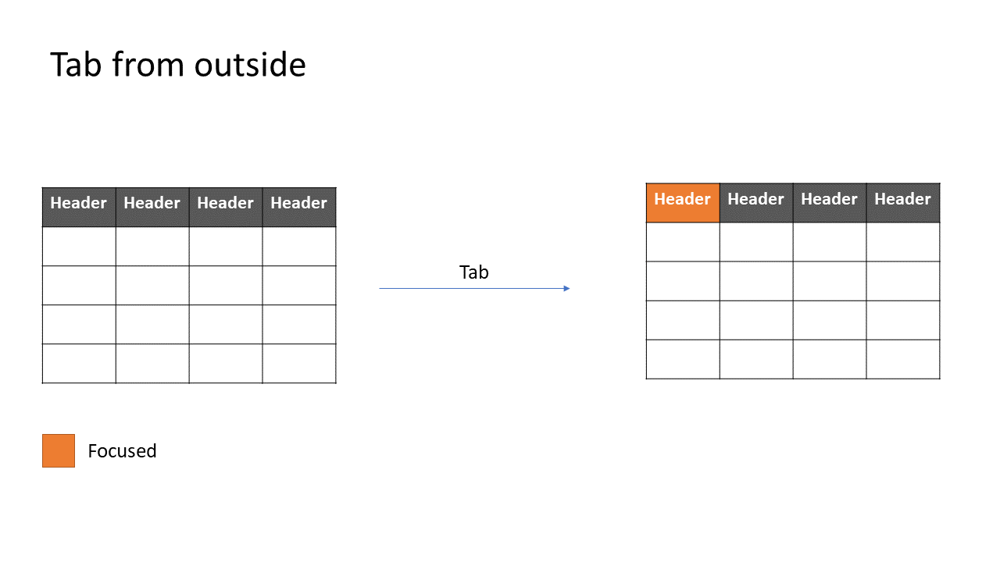
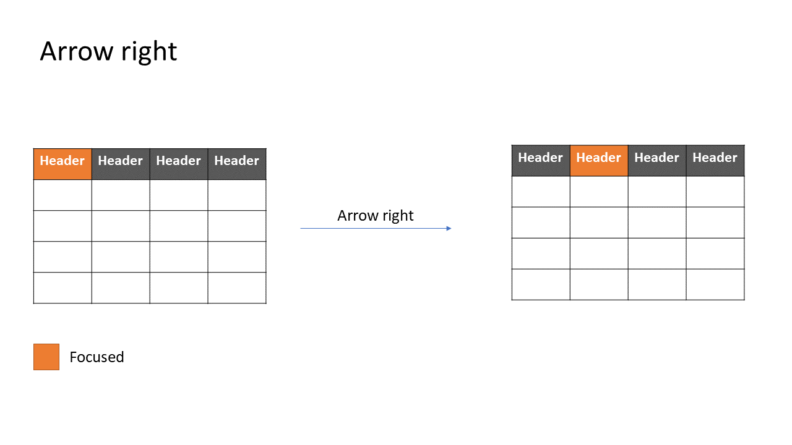
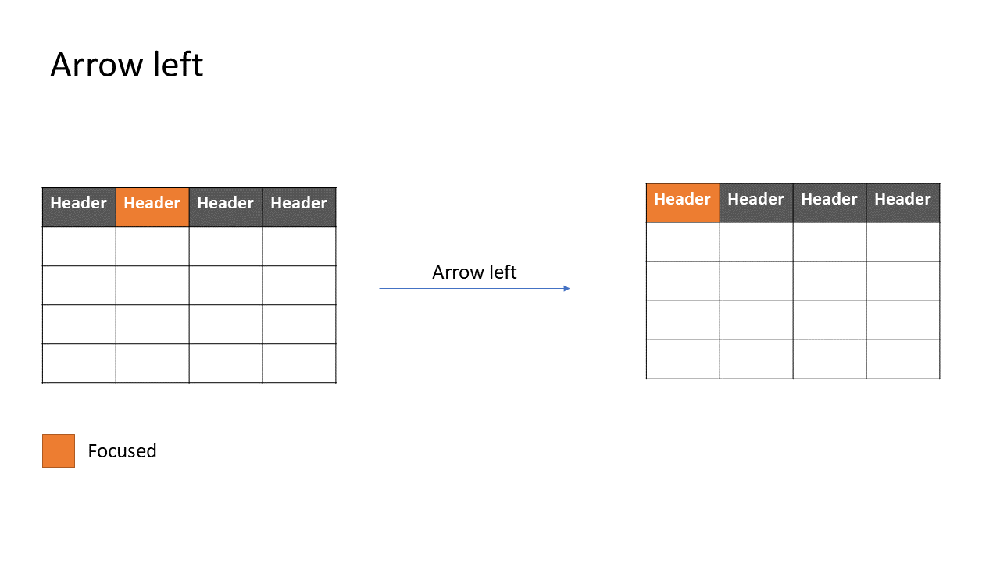

### Navigation modes

The below are the different navigation modes that are possible on a table

#### none

This mode is the default, there is no keyboard navigation possible in the table content. However, this does not
include the header cells which can be sortable. They are covered above.

#### cell

This is the most accessible and screenreader friendly navigation mode. This is what is recommended by the
[WAI APG examples](https://www.w3.org/WAI/ARIA/apg/patterns/grid/examples/data-grids/). Navigation happsn only
on the level of the cell in both directions.

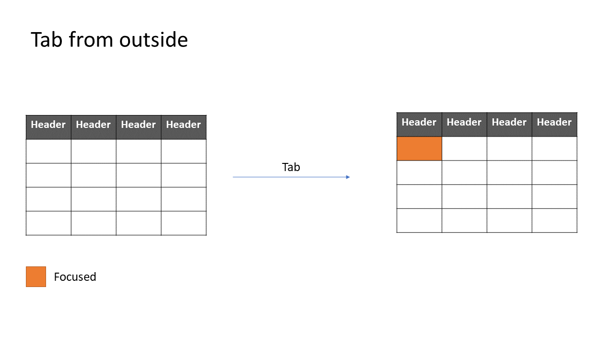
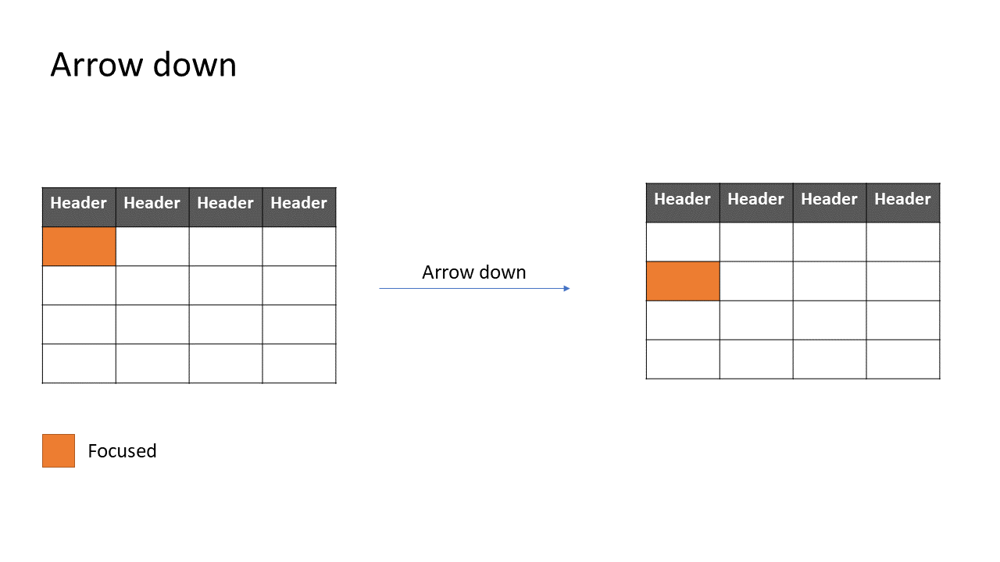
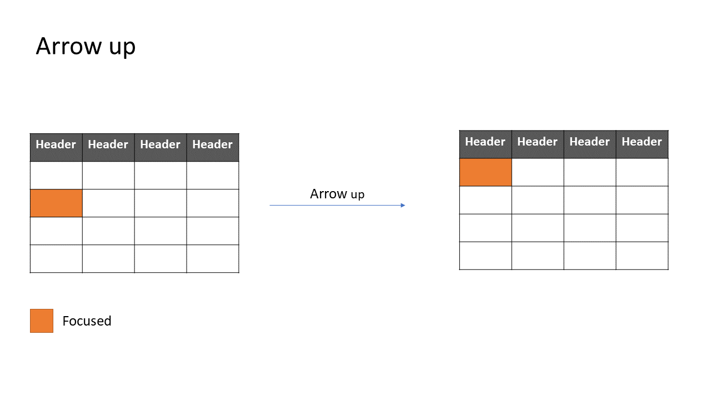
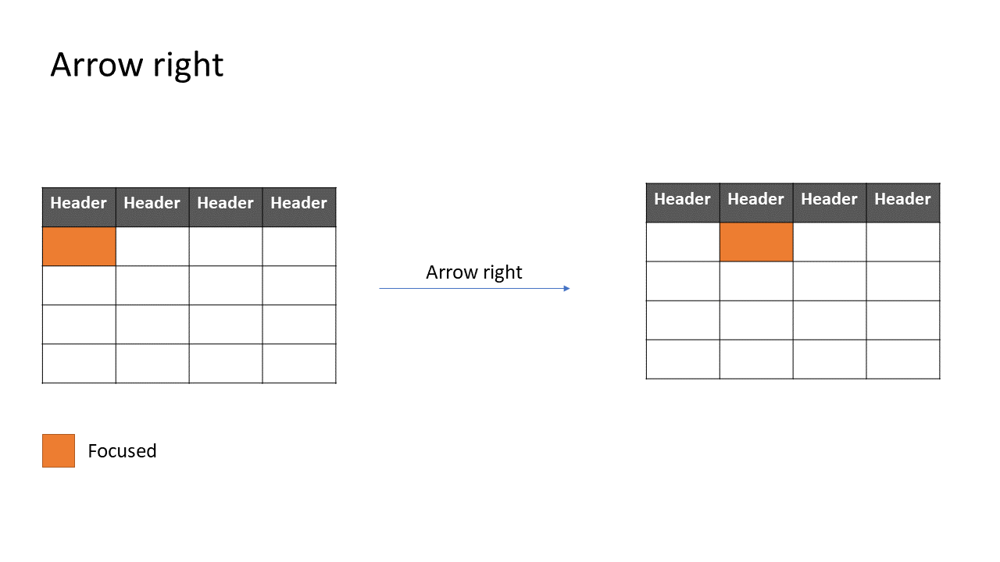
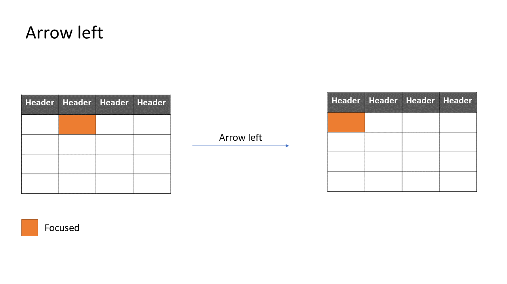

#### row

This navigation mode can cause screen reader issues since tables are not intended to be navigated by row in any mode.
This mode only navigates the table by row and can be useful when row selection is the only interactive feature of
the component

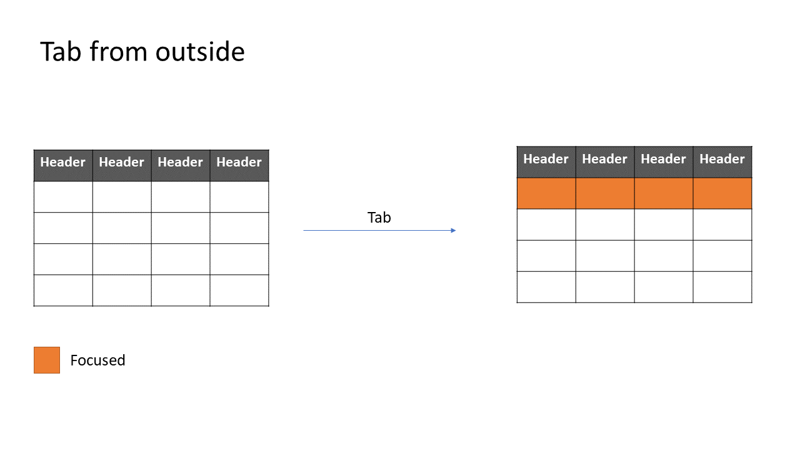
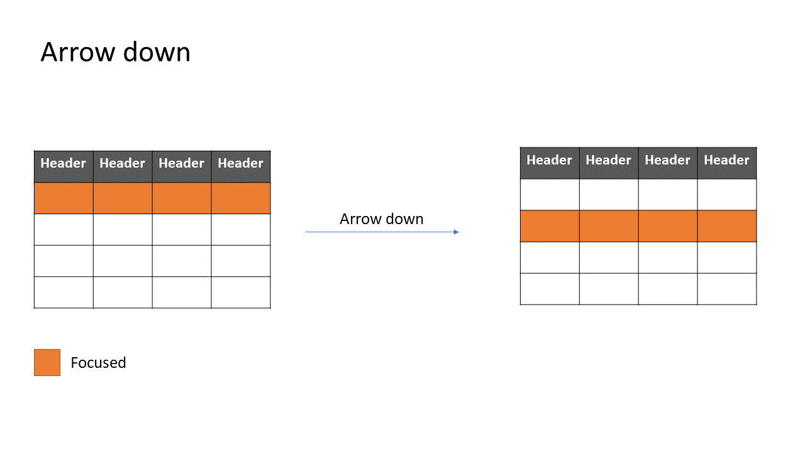
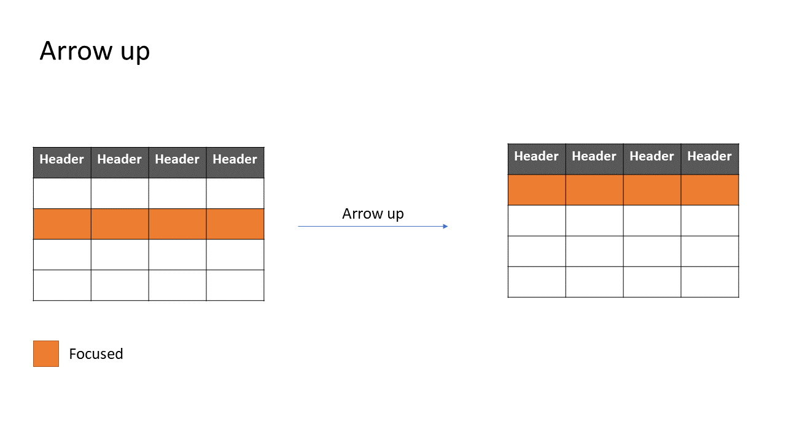

### Nested focusables in cells

#### Single focusable

When there is a single focusable element inside a cell, users are recommended to choose `cell` navigation mode.
In this scenario, cells will be focused on navigation, but the focusable
element inside the cell should be focused if it exists.

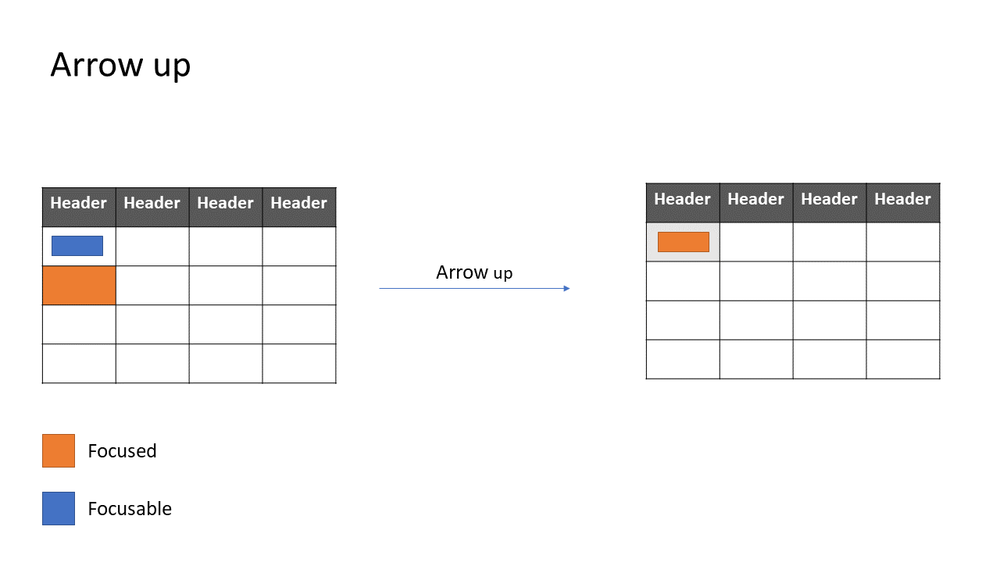
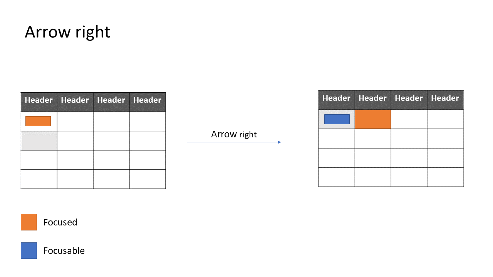

#### Nested focusable

When there are multile focusable elemnts inside a cell, we implement a pattern similar to the [WAI grid pattern](https://www.w3.org/WAI/ARIA/apg/patterns/grid/).
Pressing `Enter` on a cell will move focus and trap focus inside until the user presses `Escape` to revert back to grid navigation.

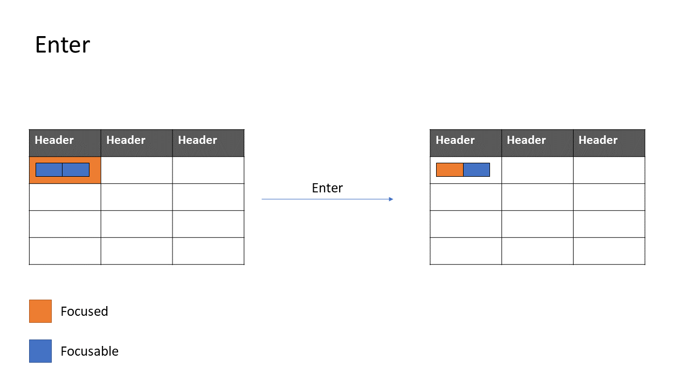

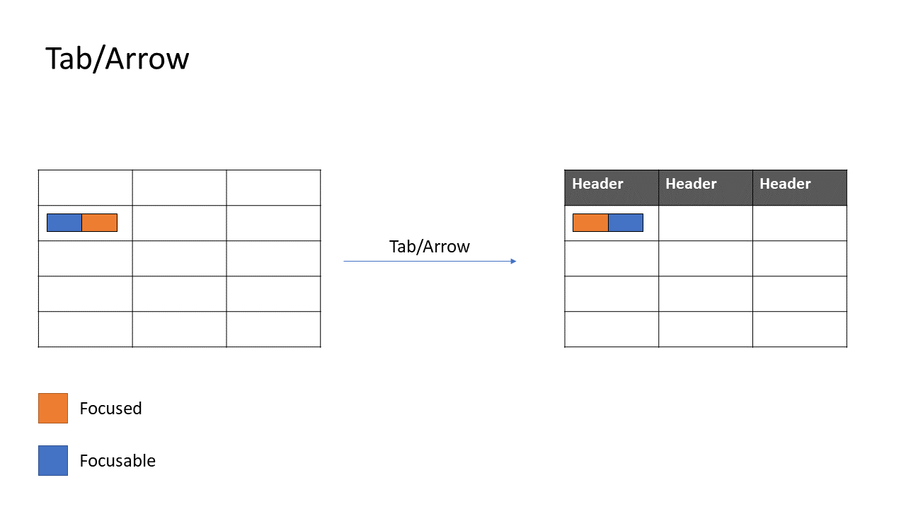
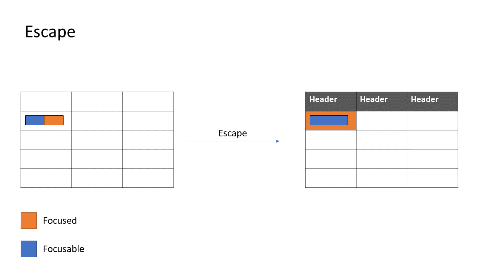
## Accessibility

The spec aims to use the accessibility section as little as possible and building an accessible component by default.
The follow a11y resources were used in the drafting of this spec:

- https://www.w3.org/WAI/ARIA/apg/patterns/grid/
- https://www.w3.org/WAI/ARIA/apg/patterns/grid/examples/data-grids/
- https://www.w3.org/WAI/ARIA/apg/example-index/table/sortable-table.html
- https://www.w3.org/WAI/ARIA/apg/example-index/table/table
- https://developer.mozilla.org/en-US/docs/Web/Accessibility/ARIA/Roles/grid_role
- https://developer.mozilla.org/en-US/docs/Web/Accessibility/ARIA/Roles/table_role
